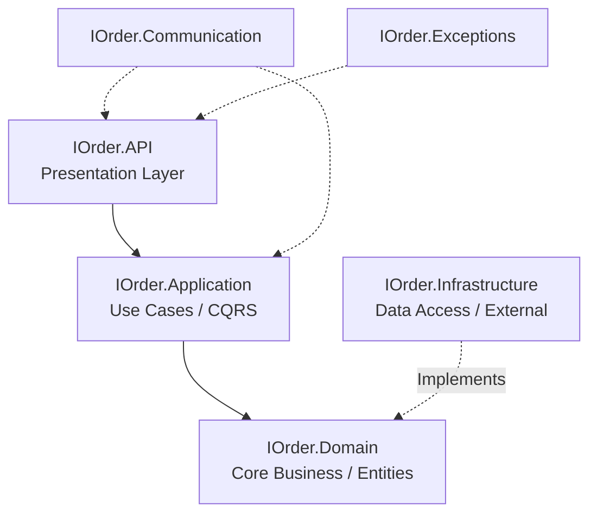

<div align="center">
  <h1>🛒 IOrder Platform</h1>
  <p><strong>A modern, real-time custom ordering and delivery platform</strong></p>

  <!-- Badges -->
  <p>
    
    
    
    
    
  </p>
</div>

---

**IOrder** é uma plataforma de encomendas personalizadas inspirada no modelo de grandes apps de delivery, mas com um diferencial: foco em **encomendas de todos os tipos** (comidas, roupas, itens personalizados, etc.) com fluxo de aprovação e negociação direta entre cliente e lojista através de um chat em tempo real.

> 🏆 **Projeto de portfólio** com foco em boas práticas de engenharia de software, arquitetura limpa (Clean Architecture, DDD) e tecnologias escaláveis.

## 📸 Screenshots

*(Adicione aqui screenshots reais da sua aplicação. Exemplo:)*
- `Home Page`: *Uma visão geral das lojas.*
- `Store Page`: *Listagem de produtos e menu.*
- `Admin Dashboard`: *Visão do lojista.*

---

## 🚀 Funcionalidades & Roadmap

<details open>
<summary><b>🛠️ Backend (ASP.NET Core Web API — C#)</b></summary>
<br>

- ✅ **Arquitetura Limpa**: Clean Architecture + DDD com SeedWork.
- ✅ **Gestão de Catálogo**: CRUD de Produtos, Lojas e Categorias com paginação dinâmica.
- ✅ **Customização Avançada de Produtos**: Grupos de opções estruturadas (SingleChoice / MultipleChoice) com precificação dinâmica.
- ✅ **Chat em Tempo Real**: SignalR integrado ao fluxo de pedidos.
- ✅ **Mensageria & Eventos**: RabbitMQ (fila de chat com dedup) e Apache Kafka (domain events).
- ✅ **Notificações Multi-Canal**: E-mail (SmtpClient) e WhatsApp (Evolution API).
- ✅ **Performance**: Cache-Aside Distribuído (Redis) com invalidação automática via Decorator Pattern.
- ✅ **Background Workers**: Recuperação de carrinhos abandonados e sincronização de promoções.
- ✅ **Pagamentos**: Integração avançada com **Stripe** (Cartão, PIX, Boleto) via Webhooks.
- ✅ **Delivery**: Módulo de entregas com rastreamento geoespacial.
- ✅ **Avaliações**: Sistema de rating para lojas e entregadores.
</details>

<details open>
<summary><b>🎨 Frontend (Angular 20)</b></summary>
<br>

- ✅ **Experiência do Cliente**: Home page otimizada, carrinho de compras robusto, checkout e acompanhamento do pedido.
- ✅ **Painel Admin**: Gestão de loja (setup, dashboard, catálogo, configurações).
- ✅ **App do Entregador**: Layout dedicado com mapas interativos (Leaflet).
- ✅ **Chat Nativo**: Integração com SignalR para chat entre cliente e loja com recibos de leitura.
- ✅ **Segurança**: Autenticação e autorização via Auth0 (Guards por Roles).
</details>

<details open>
<summary><b>☁️ Infraestrutura & DevOps</b></summary>
<br>

- ✅ **Containers**: MySQL 8.0 e Redis encapsulados via Docker.
- ✅ **CI/CD**: Pipeline automatizado no Azure DevOps (build, testes, cobertura).
- ✅ **Integração Contínua**: Testes de integração robustos usando **TestContainers**.
</details>

---

## 🏗️ Arquitetura

O projeto adota os princípios de **Clean Architecture** em conjunto com **Domain-Driven Design (DDD)**. 

### Visão Geral



| Camada | Responsabilidade |
|---|---|
| 🌐 **API** | Controllers HTTP, Filtros, Swagger, Configuração do SignalR. |
| ⚙️ **Application** | Regras de orquestração (Use Cases), Commands/Queries, Validações (FluentValidation). |
| 💎 **Domain** | Entidades ricas, Aggregates, Value Objects, Domain Events. (Zero dependências externas). |
| 🗄️ **Infrastructure** | Implementação com EF Core, Repositórios, Redis, Cloudinary, Workers e Consumers. |

---

## ⚡ Destaques Técnicos

### Cache-Aside Distribuído (Redis)
Utilizamos o **Decorator Pattern** nos repositórios para interceptar consultas. Se o dado não estiver no cache, a busca ocorre no MySQL, é armazenada no Redis e retornada. Em operações de escrita, o cache é invalidado automaticamente, garantindo alta performance sem poluir a camada de aplicação.

### Mensageria e Dedup (RabbitMQ + Kafka)
- **Kafka**: Orquestra Domain Events (`OrderCreated`, `PriceChanged`, etc.) de forma resiliente, notificando clientes via WhatsApp e Email.
- **RabbitMQ**: Processa mensagens do chat em alta velocidade.
- **Redis Dedup**: Implementa chaves TTL para evitar envio de notificações duplicadas em cenários de retry (Idempotência).

### Pagamentos com Stripe
Fluxo híbrido implementando `Payment Intents API` no Backend e `Stripe Elements` no Frontend. O processamento é inteiramente assíncrono e baseado na confirmação segura via webhooks.

---

## 🚀 Como Executar

### Pré-requisitos
- Docker Desktop
- .NET SDK 10.0
- Node.js 22+
- Angular CLI

### 1. Ambiente Local (Docker)
```bash
# Sobe o MySQL e o Redis
docker run -d --name mysql-iorder -p 2552:3306 -e MYSQL_ROOT_PASSWORD=@Password123 -e MYSQL_DATABASE=iorderdb mysql:8.0
docker run -d --name redis-iorder -p 6379:6379 redis:7-alpine
```

### 2. Configurações
Atualize o `appsettings.Development.json` no projeto `IOrder.API`:
```json
{
  "ConnectionStrings": {
    "DefaultConnection": "server=localhost;port=2552;userid=root;password=@Password123;database=iorderdb"
  },
  "RedisConnection": "localhost:6379",
  "Authentication": { /* Credenciais Auth0 */ },
  "Cloudinary": { /* Credenciais Cloudinary */ }
}
```

### 3. Subindo a Aplicação
```bash
# Backend (Swagger em https://localhost:7023/swagger)
cd src/Backend/IOrder.API
dotnet run

# Frontend (Disponível em http://localhost:4200)
cd src/Frontend
npm install
npm start
```

---

## 🧪 Testes

A aplicação possui excelente cobertura de testes e garante resiliência em CI/CD.

```bash
# Unidade
dotnet test tests/UseCases.Test
dotnet test tests/Validators.Tests

# Integração (Requer Docker rodando para TestContainers)
dotnet test tests/WebApi.Test
```

> **Dica**: O TestContainers sobe bancos de dados reais e efêmeros durante os testes, garantindo que as queries SQL e a interação com o banco estejam 100% corretas.

---
<p align="center">Desenvolvido com 🩵 e muito código.</p>
